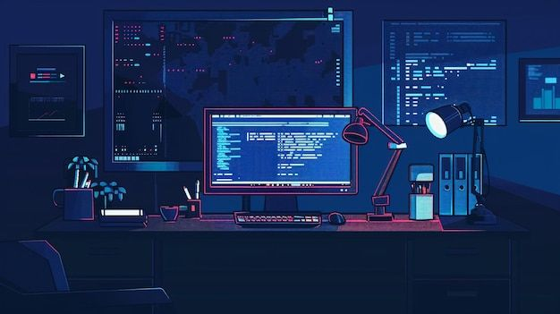

<!-- Banner -->
<p align="center">
  
</p>

<!-- Profile Section -->
<div align="center">
  <br/>
  
  <br/><br/>
  
  <h2>Hey there! I'm <b>Van</b> 👋</h2>
  
  <p>
    <em>A creative web developer who loves building<br/>minimalist, functional, and beautiful web experiences.</em>
  </p>
  
</div>

<br/>

---

<br/>

### 🧑‍💻 About

```js
const van = {
  location: "Indonesia 🇮🇩",
  learning: ["Next.js", "Express.js", "TypeScript"],
  passion: "Clean & Aesthetic UI/UX",
  available: true, // Open for freelance & collaboration
};
```

<br/>

### 🛠️ Tech Stack

<p>
  
  <br/><br/>
  
  <br/><br/>
  
</p>

<br/>

### 📊 GitHub Stats

<p>
  <picture>
    <source media="(prefers-color-scheme: dark)" srcset="https://github-readme-stats.vercel.app/api?username=rivaannn&show_icons=true&hide_border=true&bg_color=0d1117&title_color=6C9EFF&icon_color=6C9EFF&text_color=c9d1d9" />
    
  </picture>
  <picture>
    <source media="(prefers-color-scheme: dark)" srcset="https://github-readme-stats.vercel.app/api/top-langs/?username=rivaannn&layout=compact&hide_border=true&bg_color=0d1117&title_color=6C9EFF&text_color=c9d1d9" />
    
  </picture>
</p>

<br/>

### 🤝 Connect with Me

<p>
  <a href="mailto:muhamadrivansahronie@gmail.com">
    
  </a>
  <a href="https://www.linkedin.com/in/muhamad-rivan-sahronie-082283246/">
    
  </a>
  <a href="https://www.instagram.com/rivaann_/">
    
  </a>
</p>

<br/>

---

<br/>

<div align="center">
  <sub>✨ <em>"Simplicity is the ultimate sophistication."</em></sub>
  <br/><br/>
  
</div>
